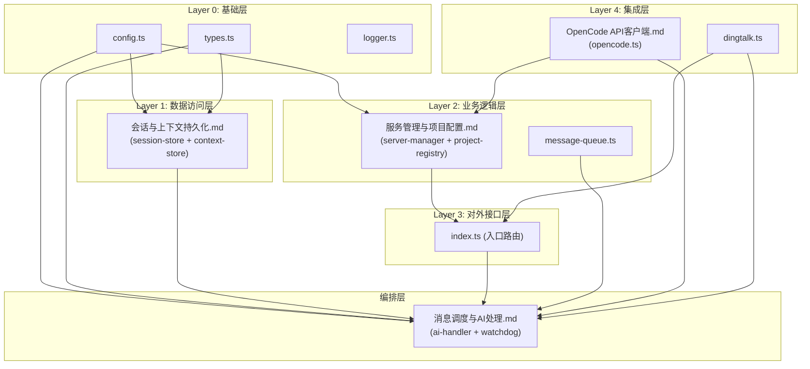

# 详细设计输出汇总

## Mermaid 依赖图



## 文档清单

| 文档 | 层次 | 覆盖模块 | 关键接口数 | 预估编码工时 |
|------|------|---------|-----------|------------|
| 会话与上下文持久化.md | Layer 1 | session-store, project-context-store | 4 | 0.5 人天 |
| 服务管理与项目配置.md | Layer 0/2 | server-manager, project-registry, config | 8 | 2 人天 |
| OpenCode API客户端.md | Layer 4 | opencode (sendMessage, session, health) | 5 | 1 人天 |
| 消息调度与AI处理.md | Layer 2/3/4 | index, ai-handler, message-queue, watchdog, dingtalk | 6 | 3 人天 |
| 编码规范.md | — | 全项目 | — | — |
| 项目规则.md | — | 全项目 | — | — |
| **合计** | | **13 个源码模块 + 2 套规则** | **23** | **6.5 人天** |

## 定位说明

> 以下指南供 coding-executor 读取文档后确定编码顺序：

```
编码顺序（按依赖链）： 
1. types.ts + config.ts + logger.ts（基础类型/配置/日志）
   → 定位: src/types.ts, src/config.ts, src/logger.ts
2. session-store.ts + project-context-store.ts（数据持久化）
   → 定位: src/session-store.ts, src/project-context-store.ts
   → 详设: 会话与上下文持久化.md
3. project-registry.ts + server-manager.ts（项目配置/服务管理）
   → 定位: src/project-registry.ts, src/server-manager.ts
   → 详设: 服务管理与项目配置.md
4. opencode.ts（OpenCode API 客户端）
   → 定位: src/opencode.ts
   → 详设: OpenCode API客户端.md
5. message-queue.ts + dingtalk.ts（工具模块）
   → 定位: src/message-queue.ts, src/dingtalk.ts
6. watchdog.ts + ai-handler.ts（核心编排）
   → 定位: src/watchdog.ts, src/ai-handler.ts
   → 详设: 消息调度与AI处理.md
7. index.ts（入口路由）
   → 定位: src/index.ts
   → 详设: 消息调度与AI处理.md

关键检查点：
- 所有 HTTP fetch 必须有超时/AbortSignal（ER-R-001）
- 看门狗异常必须捕获不传播（ER-R-002）
- 会话写入必须 2s 防抖（ER-R-003）
- 运行测试: npm test
```
